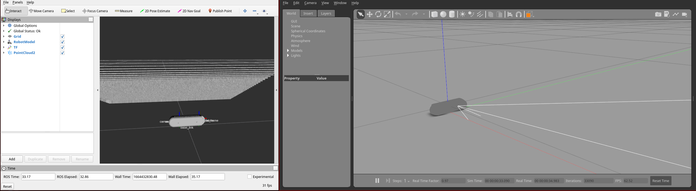
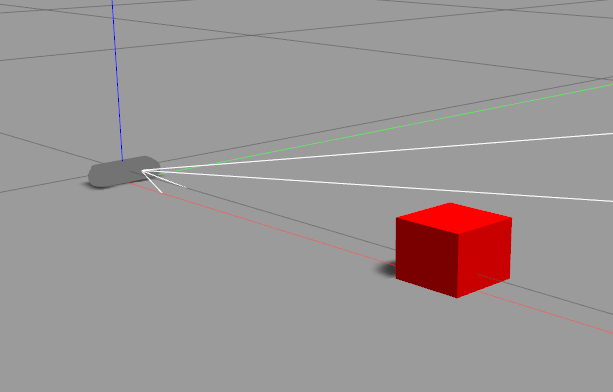
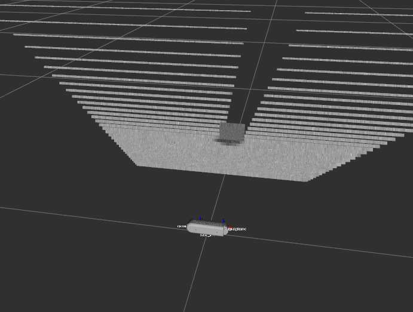
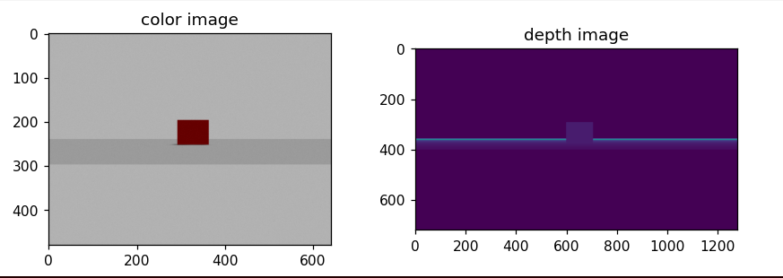

# Working with Cameras

For this section, I worked through adding a RGB-D (color and depth) camera into my simulation environment while working through [a vision-based manipulation tutorial](https://pvela.gatech.edu/classes/doku.php?id=ece4560:visman:03cam). I chose an appropriate camera to simulate, installed the appropriate packages, and wrote roslaunch files to test out various aspects of the camera.

## Configuring the RGB-D camera

I took a look at adding a Kinect or Realsense D435i into the environment, since these are the cameras available in the lab. After reading through a nice summary in [GraspKpNet], I decided to go with the RealSense.

> We are supporting two types of cameras: Kinect Xbox 360 and Realsense D435. Personally I will recommend Realsense since Kinect is pretty old and its driver isn't very stable.

I went ahead and installed the [realsense-ros-gazebo](https://github.com/rickstaa/realsense-ros-gazebo) package into my workspace, which includes the following catkin packages:

[graspkpnet]: https://github.com/ivalab/GraspKpNet/blob/1f7546bc36e26e5c70877c21bfec33cf1ad97330/readme/experiment.md

- `realsense_gazebo_plugin` - plugin for generating simulated sensor readings
- `realsense_description` - description/model for interacting with the camera
- `realsense_camera` - ros module for interacting with a physical camera

The fork contains a few handy launch files, and is much easier than the alternative packages that are available. I had to install the following dependencies to build the package:

- [ros-noetic-ddynamic-reconfigure](https://aur.archlinux.org/packages/ros-noetic-ddynamic-reconfigure)
- [librealsense-git](https://aur.archlinux.org/packages/librealsense-git)

The first is a build system dependency (because `rosdep` is not an option on Arch), while the second contains the drivers for the Realsense camera. This is actually not necessary since I only need the description files to work in simulation, but it is cleaner to build all the dependencies instead of adding an exclude to the builds in my workspace.

Once installed, we can test the camera in both rviz and gazebo:

```bash
roslaunch realsense2_description view_d435_model_rviz_gazebo.launch
```


_**figure**: Rviz on the left shows the sensor readings from the D435 RGB-D camera. Gazebo on the right shows the camera situation in a simulated world._

## Adding a red box to the environment

The next step was to create a custom launch file that can be used to test out the sensor readings using an object of my choice. I decided to pull in code from a couple of different sources:

- [ivaLab/simData_imgSaver/models/box/description.sdf](https://github.com/ivalab/simData_imgSaver/blob/master/models/box/description.sdf) - an initial box description, the repository was generally a good reference for how I should set up my own models directory
  - [[Gazebo] - Adding Color and Textures to a Model](https://classic.gazebosim.org/tutorials?tut=color_model) also followed this tutorial to make the box red
- [rickstaa/realsense-ros/realsense2_description/launch/view_d435_model_rviz_gazebo.launch](https://github.com/rickstaa/realsense-ros/blob/da38e309c2fbe88e45e6148bf5d944486b3e8e98/realsense2_description/launch/view_d435_model_rviz_gazebo.launch) - the launch file for rviz and gazebo

One particularly useful trick is to set up the [model path in `package.xml` with the following lines](https://answers.gazebosim.org/question/6568/uri-paths-to-packages-in-the-sdf-model-file/?answer=7664#post-id-7664):

```xml
<export>
    <!-- https://answers.gazebosim.org/question/6568/uri-paths-to-packages-in-the-sdf-model-file/?answer=7664#post-id-7664 -->
    <!-- gazebo_ros_paths_plugin automatically adds these to
        GAZEBO_PLUGIN_PATH and GAZEBO_MODEL_PATH when you do this export inside
        the package.xml file. You can than use URIs of type model://my_package/stuff. -->
    <gazebo_ros
    gazebo_plugin_path="${prefix}/lib"
    gazebo_model_path="${prefix}"
  />
</export>
```

Then the box can be spawned via `gazebo_ros` without having to muck around with environment variables before launching gazebo:

```xml
  <param
    name="model_description"
    textfile="$(find handy_warehouse_demo)/models/box/description.sdf"
  />
  <arg name="distance" default="0.3" />
  <node
    name="model_spawner"
    pkg="gazebo_ros"
    type="spawn_model"
    respawn="false"
    output="screen"
    args="-sdf -x $(arg distance) -y 0.01 -z 0.02 -param model_description -model box"
  />
```

The full launch file can be viewed under [handy_warehouse_demo/launch/camera_box.launch](../handy_warehouse_demo/launch/camera_box.launch).

```bash
roslaunch handy_warehouse_demo camera_box.launch
```

Like before, we get a gazebo and rviz window with the camera sensor and model. We also get a red box placed directly in front of the camera.



_**figure:** a red block positioned in front of the camera_



_**figure:** a depth reading of the block in front of the camera_

We can pass arguments into the launch to adjust the distance:

```bash
roslaunch handy_warehouse_demo camera_box.launch distance:=0.5
```

This sets the position of the box relative to the origin (which happens to be the location of the camera).

## Interacting with the camera and box topic

Now that we have the environment set up, we can start to interact with it. First, we launch `camera_box.launch` in a process, and open a terminal where we can interact with ros.

```bash
$ rostopic list

/camera/color/camera_info
/camera/color/image_raw
/camera/color/image_raw/compressed
/camera/color/image_raw/compressed/parameter_descriptions
/camera/color/image_raw/compressed/parameter_updates
...
```

We are interested in `/camera/color/image_raw` and `/camera/depth/image_raw` to display the image. With the OpenCV bridge, this is straightforward and can be run from a REPL:

```python
import rospy
from sensor_msgs.msg import Image
from cv_bridge import CvBridge
import matplotlib.pyplot as plt

# required setup
rospy.init_node("realsense_subscriber")

# get a message from the topic containing a color image
# the first argument is set by the topic namespace passed into the included sensor gazebo launch file
# the second argument allows us to deserialize the object
msg = rospy.wait_for_message("/camera/color/image_raw", Image)

# decode the message and plot
bridge = CvBridge()
img = bridge.imgmsg_to_cv2(msg, msg.encoding)

# show the image
plt.imshow(img)
plt.show()
```

We demonstrate the use of the bridge inside of [`realsense_image_snapshot.py`](../handy_warehouse_demo/src/realsense_image_snapshot.py) as part of the demo launch file.



On the left we get a color image of the box, and on the right we get a depth image of the box and horizon.

We can also manipulate the box in this environment. We [follow this tutorial](https://varhowto.com/how-to-move-a-gazebo-model-from-command-line-ros/) on moving the model from the command-line, and eventually translate this into a set of unit tests.

```bash
rosservice call /gazebo/get_model_state "model_name: box"
```

We get a yaml representation of the message as a result.

```yaml
header:
  seq: 1
  stamp:
    secs: 163
    nsecs: 765000000
  frame_id: ""
pose:
  position:
    x: 0.3
    y: 0.01
    z: 0.02
  orientation:
    x: 0.0
    y: 0.0
    z: 0.0
    w: 1.0
twist:
  linear:
    x: 0.0
    y: 0.0
    z: 0.0
  angular:
    x: 0.0
    y: 0.0
    z: 0.0
success: True
status_message: "GetModelState: got properties"
```

Now we can simply publish to the the `/gazebo/set_model_state` topic to move the box by a certain amount. We can do this one of two ways on the command line. The first is to use `rosservice` like we did above:

```bash
$ rosservice call /gazebo/set_model_state "
model_state:
  model_name: box
  pose:
    position:
      x: 0.3
"

success: True
status_message: "SetModelState: set model state done"
```

The other is to publish a message directly to the topic:

```bash
$ rostopic pub -1 /gazebo/set_model_state gazebo_msgs/ModelState "
model_name: box
pose:
  position:
    x: 0.5
"

publishing and latching message for 3.0 seconds
```

Either way works for quick testing, but we'll prefer to use python where possible.

## Unit testing the camera

With the mechanics of subscribing and publishing to topics out of the way, we put together a unit test that performs the following:

- checks that we can subscribe to the `camera` topic and see the red box
- checks that as we move the box away from the origin, the amount of red is monotonically decreasing

This test helps verify that the environment is set up correctly. Inside of the `handy_warehouse_demo` package directory, we can run the following command:

```bash
$ catkin test --this

...
[handy_warehouse_demo.rosunit-camera_box/test_camera_can_see_red_box][passed]
[handy_warehouse_demo.rosunit-camera_box/test_camera_red_increases_when_box_moves_closer][passed]

SUMMARY
 * RESULT: SUCCESS
 * TESTS: 2
 * ERRORS: 0
 * FAILURES: 0
```

See [tests/camera_box.test](../handy_warehouse_demo/tests/camera_box.test) and the [test_camera_box.py](../handy_warehouse_demo/tests/test_camera_box.py) for the implementation of the unit tests.

We take use [python_ros](https://github.com/machinekoder/ros_pytest), which will need to be added to the catkin workspace. I personally find it much easier to use pytest over the nose or unittest packages. There are a few things that I found interesting while putting together the tests:

- the launch file for the test is like any other launchfile; here we pass arguments into our `camera_box.launch` file so we can run the tests without launching the gui interfaces for gazebo and rviz.
- tests were a great way to try out the rpc mechanisms in ros, but there is a downside of having to run the entire suite of tests alongside the 5-10 second startup time for launching the test.
- it's not easy to get standard out from the tests, which is unfortunate because printing ends up being a useful part of testing things. It might be useful to try the `--pdb` flag alongside the `-k <filter>` flags next time I'm writing a test.

Overall, it's reassuring that I can put in a simple validation of the environment, which I hope to incorporate into an docker image and maybe even continuous integration at a later date.

## references

- https://classic.gazebosim.org/tutorials?tut=ros_gzplugins
- https://classic.gazebosim.org/tutorials?tut=ros_depth_camera&cat=connect_ros
- https://classic.gazebosim.org/tutorials?tut=color_model
- https://github.com/ivalab/GraspKpNet/blob/1f7546bc36e26e5c70877c21bfec33cf1ad97330/readme/experiment.md
- https://github.com/ivalab/aruco_tag_saver_ros
- https://github.com/ivaROS/turtlebot_description/blob/06968fca967b5615be3344f2b8843dff9856bd9e/urdf/sensors/kinect.urdf.xacro
- https://github.com/IntelRealSense/realsense-ros
- https://github.com/IntelRealSense/realsense-ros/issues/1453#issuecomment-710226770
- https://github.com/pal-robotics/realsense_gazebo_plugin
- https://github.com/rickstaa/realsense-ros-gazebo
- https://varhowto.com/how-to-move-a-gazebo-model-from-command-line-ros/
- https://answers.gazebosim.org//question/22125/how-to-set-a-models-position-using-gazeboset_model_state-service-in-python/
- https://answers.ros.org/question/261782/how-to-use-getmodelstate-service-from-gazebo-in-python/
- http://wiki.ros.org/rostest/Writing
- https://answers.ros.org/question/115526/is-test_depend-actually-used-for-anything/
- https://github.com/machinekoder/pytest-ros-node-example
- https://github.com/machinekoder/ros_pytest
