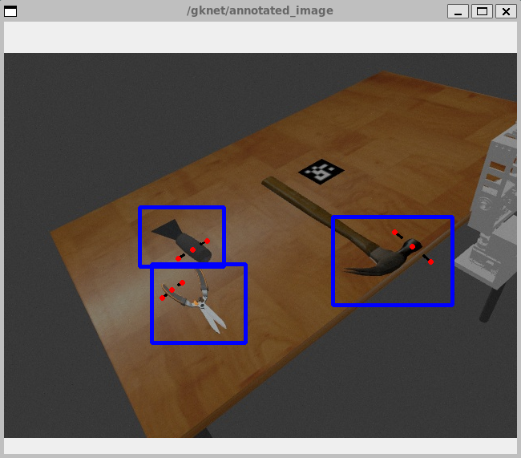
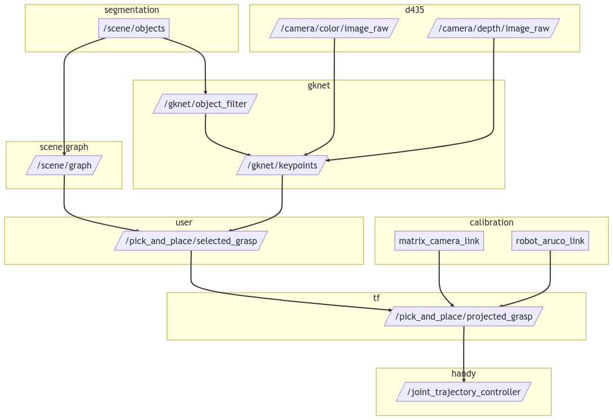

<!---
To generate the PDF for the document, run the following command:

```bash
make report-spr23
```

* Summary of what was done.
* Description of major code modules written. (links to github repositories)
* What were to two major points learnt.
* Describe what the expectation at the beginning of the class was.
* Describe what would do with an additional semester to meet or expand expectation.
* Describe what would do differently to be more efficient about progress if doing semester over again.
* Link to research journal or attach as appendix.
-->

## Summary

As part of _Manipulation and Understanding_ sub-team, I worked toward building a pick and place simulation using Handy as the base manipulator.
I updated and refactored Handy ROS packages to work with ROS Noetic and Gazebo, and created a Docker environment to facilitate usage.
I reproduced benchmarks from the Grasp Keypoint Network (GKNet) paper using the source code, and created ROS modules for inference.
I also build up the scaffolding for performing pick and place tasks that includes calibration, workplace setup, perception, and manipulation.
Relevant code is available on Github, either in standalone repositories or contributed back into various IVALab repositories.

## Code Contributions

### ivapylibs/camera

Repository: [ivapylibs/camera](https://github.com/ivapylibs/camera)

- [[ivapylibs/camera] Refactor directory structure of the camera package #4 ](https://github.com/ivapylibs/camera/pull/4)
  - We and move the scripts directory out into the root of the package.
    We also rename a couple of the d435 modules, and use mayavi instead of pptk.
- [[ivapylibs/camera] Use find_packages and remove old requirements.txt #5](https://github.com/ivapylibs/camera/pull/5)
  - We use `find_package` and update the `setup.py` to use references to packages via `git+https://`.
    We go through all ivapylibs packages and update the `setup.py` files to match.
- [[ivapylibs/camera] Update CtoW_Calibrator_aruco with optional aruco_dict parameter #6](https://github.com/ivapylibs/camera/pull/6)
  - This allows estimation of the camera extrinsic using user-defined values for the aruco dictionary.
    The `aruco_dict` parameter is needed because the one used in simulation or physical experiments may not match the hardcoded value in the library.

### ivaROS/ivaHandy

Repository: [ivaROS/ivaHandy](https://github.com/ivaROS/ivaHandy)

- [[ivaROS/ivaDynamixel] Run 2to3 and add docker for testing #3 ](https://github.com/ivaROS/ivaDynamixel/pull/3)
  - This PR enables Handy to run on ROS Noetic and Python 3 by fixing broken serial communication.
    The main routine for writing to and from the serial device had to be rewritten for string behavior changes in Python 2 vs 3.
    We resolve this by avoiding the use of strings, and passing a valid bytearray/memory view to pyserial.
    We use the struct module to decode messages from the serial device.
- [[ivaROS/ivaHandy] Add docker-compose configuration for running Handy #3](https://github.com/ivaROS/ivaHandy/pull/3)
  - This adds documentation and docker configuration for running Handy.
    The containers bind against the host machine, so it's as if the containers are running on the host itself.
    See the [documentation for more details](https://github.com/ivaROS/ivaHandy/blob/master/docs/docker.md).
- [[ivaROS/ivaHandy] Add noetic base image #5](https://github.com/ivaROS/ivaHandy/pull/5)
  - We add a new default docker image that uses ROS Noetic as the base.
    This image validates the changes made in the ivaDynamixel package in a reproducible environment.
- [[ivaROS/ivaHandy] Update control, description, and gazebo packages for rviz/moveit control #6](https://github.com/ivaROS/ivaHandy/pull/6)
  - We fix mocked Gazebo controllers to work with MoveIt.
    The controllers now use the same namespaces as the physical robot, and behaves correctly with MoveIt.
    The controller scripts and launch files are also updated to work agnostic to simulation or physical robot.

### ivaROS/GraspKpNet

Repository: [ivaROS/GraspKpNet](https://github.com/ivalab/GraspKpNet)

- [[ivaROS/GraspKpNet] Reproduce training and benchmark results via Docker #3](https://github.com/ivalab/GraspKpNet/pull/3)
  - This PR prepares the repository for ROS integration.
    I rerun the benchmarks of the GKNet paper on available datasets and pretrained models.
    I rehost datasets on a public Backblaze bucket (see [docs/INSTALL.md](https://github.com/ivalab/GraspKpNet/blob/7114b76f880d9c5bb698318a17c0e784e8289e86/docs/INSTALL.md#downloading-models)).
    I also refactor the repository structure into a proper Python package that is easier to navigate and use externally.
    I create a docker image that includes an updated version of PyTorch, and [forked DCNv2 code to build without a GPU](https://github.com/acmiyaguchi/DCNv2/commit/44743797c656fc940523b51432f2f1b1ea5caa59).
    I also create a docker-compose configuration for running the benchmarks.
- [[ivaROS/GraspKpNet] Add ROS module for gknet perception and inference #4](https://github.com/ivalab/GraspKpNet/pull/4)
  - I add a ROS module that can be used via docker compose to process images.
    It will dump out a series of keypoints as well as an annotated image.
    The keypoints need to be transformed into the world coordinate system for the actual pick and place task.
- [[ivaROS/GraspKpNet] Add functionality to rank grasping poses on a per object basis #5](https://github.com/ivalab/GraspKpNet/pull/5)
  - This refactors the code to separate annotation into a node and adds filter ranked poses on a per-object basis.
    I've added a small opencv based utility to stream image topics (which works better than image view via docker) and to manually draw rectangles.
    { width=60% }

### ivalab/simData

Repository: [ivalab/simData](https://github.com/ivalab/simData)

- [[ivalab/simData] Generate preprocessed model files for imgSaver via catkin project #1](https://github.com/ivalab/simData/pull/1)
  - I refactor a Matlab script that generates model SDF files into the catkin build process via CMake.
    This allows the SDF files to be referenced by ROS launch files by exporting the generated model directory as a package resource.
    We use this package extensively from the pick-and-place repository.
- [[ivalab/simData] Add collision/physics to rendered models #2 ](https://github.com/ivalab/simData/pull/2)
  - With @ruinianxu's help on enabling physics, I also add collision to the model SDF using model meshes.
    This allows better simulation of items and the manipulator in Gazebo.

### Autobots-Visman/segmentation

Repository: [Autobots-Visman/segmentation](https://github.com/Autobots-Visman/segmentation)

- [[Autobots-Visman/segmentation] Add skeleton of packages with initial unit tests and docker configuration #1](https://github.com/Autobots-Visman/segmentation/pull/1)
  - I helped add boilerplate to the segmentation/perception code for the sub-team.
    The PR makes use of idiomatic ROS module patterns, and includes basic testing mechanisms.

### Autobots-Visman/pick-and-place

Repository: [Autobots-Visman/pick-and-place](https://github.com/Autobots-Visman/pick-and-place)

The Autbots-Visman/pick-and-place repository is the main deliverable for the Spring 2023 semester.
It contains a (mostly) functional demo that integrates GKNet and Handy.
It falls short of the named pick-and-place goal, but demonstrates smaller components of the system.

{width=100%}

- [ros/autobots_realsense2_description@02e12b2146](https://github.com/Autobots-Visman/pick-and-place/tree/02e12b21468fdd74739e8fc88897a893caf8b636/ros/autobots_realsense2_description)
  - This package contains a modified version of urdf files for the realsense2 camera.
    The main difference in this model is that we can turn off gravity for the camera link.
    This is useful for simulating the camera in a fixed position.
    The included launch file will configure the topics and align the depth image to the color image.
- [ros/autobots_calibration@02e12b2146](https://github.com/Autobots-Visman/pick-and-place/tree/02e12b21468fdd74739e8fc88897a893caf8b636/ros/autobots_calibration)
  - This package implements a calibration node that uses `ivapylibs/camera` to compute camera extrinsics with a single ArUco on a workspace.
    It publishes information to tf2 and a latched calibration topic.
    The package is designed to be agnostic to simulation or physical robot.
- [ros/autobots_handy_simulation@02e12b2146](https://github.com/Autobots-Visman/pick-and-place/tree/02e12b21468fdd74739e8fc88897a893caf8b636/ros/autobots_handy_simulation)
  - This package contains the Gazebo simulation for the Handy manipulator.
    It includes a launch file that will spawn the robot, tabletop, and camera in a fixed position.
    It also includes the control scripts for moving the manipulator based on GKNet inference.

## Major Points Learned

### Software engineering fluency is valuable when synthesizing a system

### Remote collaboration without access to hardware is challenging

## Expectations

## What If: Additional Semester

I would focus on completion of the pick-and-place demo with Handy and GKNet if I had another semester to expand or improve my contributions to the VIP.
There are slight differences in scope depending on whether I have one or three credit units to spend.

## What If: Redo Semester

## Research Journal
