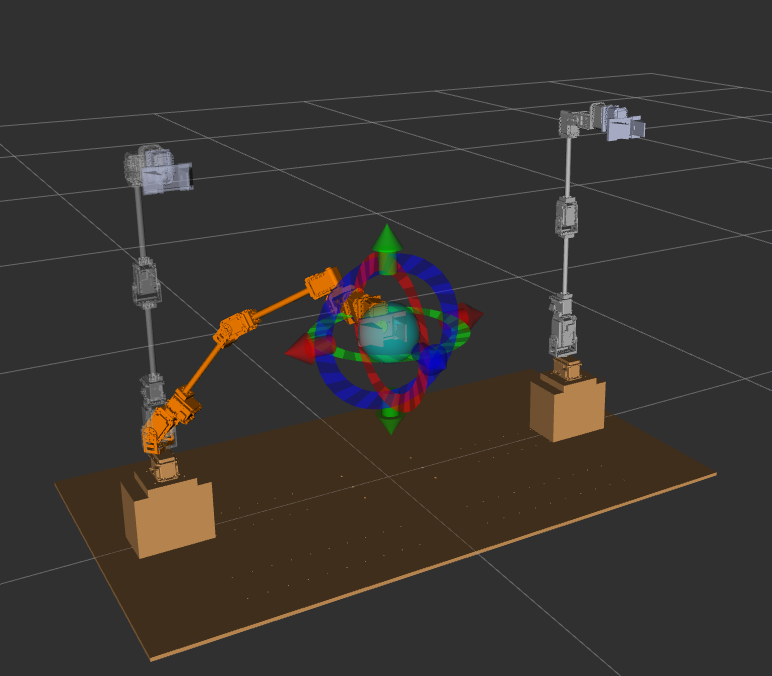
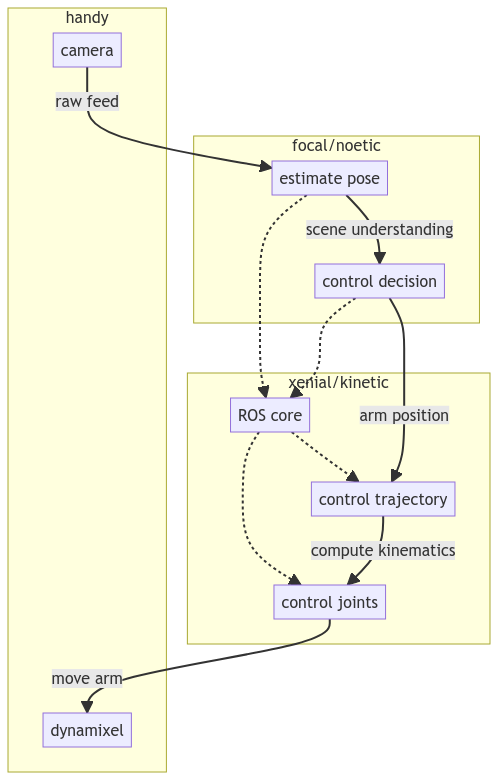
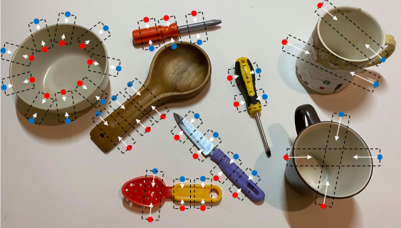

## Outline

- VisMan Subteam Progress
- Manipulators in the Lab
  - Handy, Mary, and Edy
  - Theory of Operation
  - Changes to Handy/Mary Software
- Reproducing GKNet Benchmarks
  - Overview of grasp detection
  - Datasets: Cornell and abridged Jacquard
  - Benchmark results
  - Ideas for further exploration
- Future Work
  - Simulating pick and place with Gazebo and GKNet
  - TSRB Gazebo world

## VisMan Subteam Progress

### Progress

- Established meetings and general plan for the semester
- [Scene graph ROS packages for object detection/segmentation/labeling](https://github.com/Autobots-Visman/segmentation/blob/main/README.md)
  - Functional detector on live webcam feed via YOLO
- [Pick and place simulation with Handy and GKNet](https://github.com/Autobots-Visman/pick-and-place)
  - Simulated RGBD camera tests and model imports

### Current Members

Nicholas Gilpin, Anthony Miyaguchi, Calvin Truong, Ashlynn Zheng, Ruinian Xu (advisory)

### Join our meetings!

We meet on Teams every Monday at 5:30pm EST, under the _Manipulation and Understanding_ channel.

## Manipulators in the Lab

### Overview

- Handy, Mary, and Edy
- Theory of Operation
- Changes to Handy/Mary Software

## Manipulators in the Lab: Handy

{height=60%}

- [Video of Handy in action](https://youtube.com/shorts/O0VOOsUm6Pw?feature=share)

## Manipulators in the Lab: Mary

{height=60%}

- [Video of Mary in action](https://youtube.com/shorts/SLmtYtsa8AQ?feature=share)

## Manipulators in the Lab: Edy

{height=60%}

Edy is currently awaiting reconstruction...

## Manipulators in the Lab: Theory of Operation

{height=70%}

## Manipulators in the Lab: Theory of Operation (cont.)

Booting up Handy requires starting a number of ROS nodes.

### Booting up Handy

```bash
# start a node to manage controllers
roslaunch finalarm_control controller_manager.launch
# start nodes that correspond to each of the motors
roslaunch finalarm_control start_controller.launch
# publish controllers and link transformations
roslaunch finalarm_description robot_state_pub.launch
# start node for motion planning, collision checking, etc.
roslaunch finalarm_moveit_config move_group.launch
# rviz for visualization
roslaunch finalarm_moveit_config moveit_rviz.launch
```

## Manipulators in the Lab: Theory of Operation (cont.)

{height=75%}

## Manipulators in the Lab: Handy in Practice

### Operational Overhead

- Each ROS node needs to be launched in a particular order in separate processes/terminals.
- Hard dependency on Python 2 with Dynamixel ROS, while vision code is written in Python 3.
- Installing dependencies requires a lot of manual work and knowledge of the Linux/ROS/Catkin.
- Pick and place experiments not easily reproducible; many parameters are hard-coded (camera extrinsics, directory paths, etc.)

## Manipulators in the Lab: Changes to Handy/Mary Software

### Changelog

- [Update ivaDynamixel to support Python 3; fixed broken serial messaging][dynamixel_pr]
- [Add Dockerfile for Ubuntu Xenial/ROS Kinetic environment][handy_docker_pr]
- [Add Docker Compose file for launching ROS nodes in networked containers][handy_docker_pr]
- [Upgrade Handy to run on Ubuntu Focal/ROS Noetic](https://github.com/ivaROS/ivaHandy/pull/5)
- Fix various Python packages for pip installs via `git+https` protocol e.g. [ivapylibs/camera](https://github.com/ivapylibs/camera/pull/5/files).
- Upgrade Mary to run on Ubuntu Focal/ROS Noetic.

[dynamixel_pr]: https://github.com/ivaROS/ivaDynamixel/pull/3
[handy_docker_pr]: https://github.com/ivaROS/ivaHandy/pull/3

## Manipulators in the Lab: Docker

{width=70%}

### Docker - Industry Standard for Deploying Software

What is Docker?

- Tooling to create "containers" with self-contained software
- Runs the same kernel as the host, supported by all major OSes
- Not a virtual machine (at least on Linux/WSL): boots in seconds, uses less resources, and implemented via cgroups/namespace isolation instead of hypervisor

## Manipulators in the Lab: ROS Nodes via Docker Compose

Running Handy no longer requires ROS or a Catkin workspace on the host machine.

### Running Handy via Docker Compose

```bash
# build the handy container
docker compose build handy
# start handy ROS nodes
docker compose up

# node for motion planning, collision checking, etc. jobs
roslaunch finalarm_moveit_config move_group.launch
# rviz for visualization
roslaunch finalarm_moveit_config moveit_rviz.launch
```

## Reproducing GKNet Benchmarks

### Overview

- Overview of grasp detection
- Datasets: Cornell and abridged Jacquard
- Docker builds with GPU support
- Benchmark results
- Ideas for further exploration

## Reproducing GKNet Benchmarks: Grasp Detection

Grasp detection is the task of **detecting graspable objects** in an image and **predicting the grasp pose** of the object.

Grasping detection task can be simplified by finding **keypoint pairs** $(x, y, \theta, w)^T$ instead of bounding boxes.

### GKNet Paper

[Xu, Ruinian, Fu-Jen Chu, and Patricio A. Vela. "Gknet: grasp keypoint network for grasp candidates detection." The International Journal of Robotics Research 41, no. 4 (2022): 361-389.][gknet_paper]

[gknet_paper]: https://arxiv.org/abs/2106.08497

## Reproducing GKNet Benchmarks: Grasp Detection (cont.)

{height=90%}

## Reproducing GKNet Benchmarks: Datasets

Datasets contain annotated objects in various poses.

```
datasets
|-- Cornell
|   `-- rgd_5_5_5_corner_p_full
|       `-- data
|           |-- Annotations
|           |-- ImageSets
|           `-- Images
`-- Jacquard
    `-- coco
        `-- 512_cnt_angle
            |-- test
            `-- train
```

Training datasets are linked from the [ivalab/GraspKpNet GitHub repository][gknet_repo].

[gknet_repo]: https://github.com/ivalab/GraspKpNet

## Reproducing GKNet Benchmarks: Cornell Dataset

885 RGB-D images of 244 objects with 5,110 positive and 2,909 negative grasp annotations.

{height=60%}

## Reproducing GKNet Benchmarks: Cornell Dataset (cont.)

### Annotation for `pcd0100r_rgd_preprocessed_1`

```
2 177.842467 110.189953 217.684406 128.688189 -1.193646
2 161.668984 111.392738 199.603883 137.878183 -1.250606
2 150.723138 118.692707 187.143203 137.258827 -1.232340
2 131.461796 126.084075 175.492871 140.997830 -1.164588
```

## Reproducing GKNet Benchmarks: Jacquard Dataset

More than 50,000 RGB-D images of 11,000 objects with 1,000,000 positive grasp annotations. Simulated.

{height=60%}

## Reproducing GKNet Benchmarks: Jacquard Dataset (cont.)

{height=70%}

## Reproducing GKNet Benchmarks: Docker Container

See [ivalab/GraspKpNet PR #3](https://github.com/ivalab/GraspKpNet/pull/3)

### Changelog

- Dockerfile with Ubuntu 20.04, CUDA 11.7, and PyTorch 1.13
- Install ROS Noetic core libraries
- Fix build process of Deformable Convolutional Networks (DCNv2)
- Refactor GKNet as an importable Python package
- Add Docker Compose configuration for development and testing
- Mirror models and datasets on public Backblaze B2 bucket

## Reproducing GKNet Benchmarks: Docker Container (cont.)

{height=70%}

## Reproducing GKNet Benchmarks: Docker Container (cont.)

Windows 11 and a NVIDIA 1080 Ti (CUDA 11.7) on Docker Desktop via WSL2.

### Docker Compose command

```bash
docker compose run --rm gpu \
  python scripts/test.py dbmctdet_cornell \
    --exp_id dla34_test \
    --arch dla_34 \
    --dataset cornell \
    --fix_res \
    --flag_test \
    --load_model models/model_dla34_cornell.pth \
    --ae_threshold 1.0 \
    --ori_threshold 0.24 \
    --center_threshold 0.05
```

## Reproducing GKNet Benchmarks: Results

| exp_id                 | dataset     | accuracy |     fps |
| :--------------------- | :---------- | -------: | ------: |
| model_alexnet_ajd      | jac_coco_36 | 0.973701 | 82.4871 |
| model_dla34_ajd        | jac_coco_36 | 0.983857 | 75.2168 |
| model_resnet18_ajd     | jac_coco_36 | 0.979474 | 75.3912 |
| model_resnet50_ajd     | jac_coco_36 |  0.98236 | 76.1191 |
| model_vgg16_ajd        | jac_coco_36 | 0.983643 | 81.8511 |
| model_alexnet_cornell  | cornell     |  0.94663 | 281.826 |
| model_dla34_cornell    | cornell     | 0.967843 | 156.066 |
| model_resnet18_cornell | cornell     | 0.957123 | 284.024 |
| model_resnet50_cornell | cornell     | 0.961556 | 280.632 |
| model_vgg16_cornell    | cornell     | 0.964224 | 280.728 |

Results have similar accuracy; FPS achieved on NVIDIA 1080 Ti is higher than reported in the paper.

## Reproducing GKNet Benchmarks: Further Ideas

- Pose estimation for other grasping orientations e.g. items from a shelf
- Training and evaluating GKNet on a primitive shapes dataset
  - [Lin, Yunzhi, Chao Tang, Fu-Jen Chu, and Patricio A. Vela. "Using synthetic data and deep networks to recognize primitive shapes for object grasping." In 2020 IEEE International Conference on Robotics and Automation (ICRA), pp. 10494-10501. IEEE, 2020.](https://arxiv.org/abs/1909.08508)
- Neural Radiance Fields (NeRFs) for training augmentation or direct pose estimation
  - [Dellaert, Frank, and Lin Yen-Chen. "Neural volume rendering: Nerf and beyond." arXiv preprint arXiv:2101.05204 (2020).](https://arxiv.org/abs/2101.05204)
  - [Yen-Chen, Lin, Pete Florence, Jonathan T. Barron, Alberto Rodriguez, Phillip Isola, and Tsung-Yi Lin. "inerf: Inverting neural radiance fields for pose estimation." In 2021 IEEE/RSJ International Conference on Intelligent Robots and Systems (IROS), pp. 1323-1330. IEEE, 2021.](https://arxiv.org/abs/2012.05877)
  - [[GitHub] awesome-NeRF/awesome-NeRF](https://github.com/awesome-NeRF/awesome-NeRF)

## Future Work

### Simulating pick and place with Gazebo, Handy, and GKNet

- Goal is for simulation closely match lab procedures with physical operation of robots.
- Provide a platform for higher level scene understanding and natural language work. Tie in with Factory Automation and Assistive Robotics.
- ETA 2-4 weeks for a working prototype.

### TSRB Gazebo world

- Configure [ivaROS/customWorlds](https://github.com/ivaROS/customWorlds) as a ROS package with Gazebo model exports.
- Generate a subset of the world local to TSRB 444.
- Find a volunteer to help flesh out the world in context of Factory Automation task.

## Thank you!

{height=60%}
