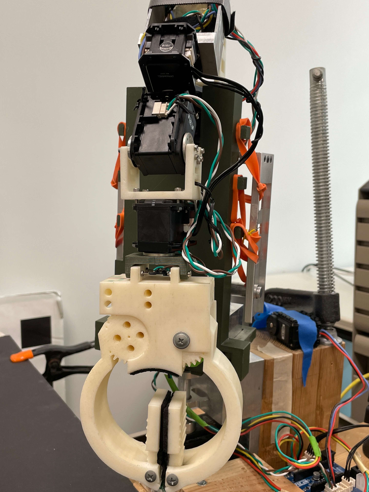
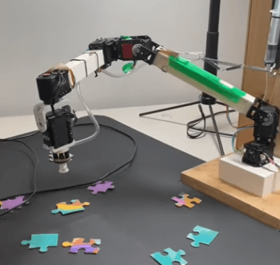
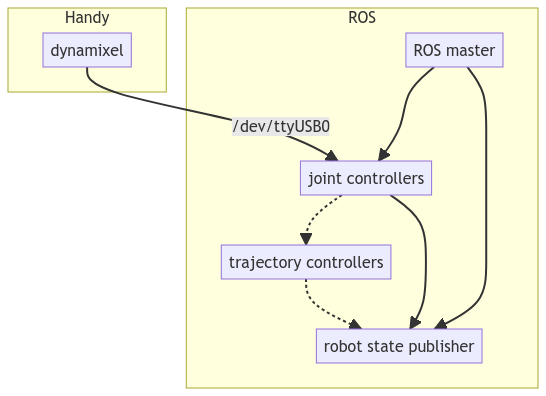
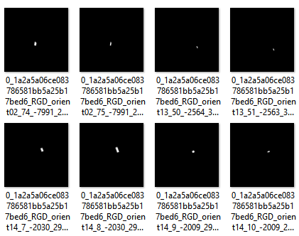
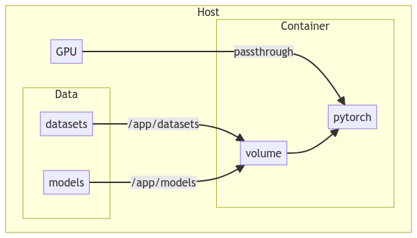

## Outline

- Manipulators in the Lab
  - Handy and Mary
  - Theory of operation
  - ROS nodes via Docker Compose
- Reproducing GKNet Benchmarks
  - Overview of grasp detection
  - Benchmark results
  - Ideas for further exploration
- Future Work
  - Simulating pick and place with Gazebo and GKNet
  - TSRB Gazebo world

## Manipulators in the Lab

### Overview

- Handy and Mary
- Theory of operation
- ROS nodes via Docker Compose

## Manipulators in the Lab: Handy

{height=60%}

- [Video of Handy in action](https://youtube.com/shorts/O0VOOsUm6Pw?feature=share)

## Manipulators in the Lab: Mary

{height=60%}

- [Video of Mary in action](https://youtube.com/shorts/SLmtYtsa8AQ?feature=share)

## Manipulators in the Lab: Theory of Operation

{height=70%}

## Reproducing GKNet Benchmarks

### Overview

- Overview of grasp detection
- Datasets: Cornell and abridged Jacquard
- Docker builds with GPU support
- Benchmark results
- Ideas for further exploration

## Reproducing GKNet Benchmarks: Grasp Detection

{height=90%}

## Reproducing GKNet Benchmarks: Grasp Detection (cont.)

Grasp detection is the task of detecting graspable objects in an image and predicting the grasp pose of the object.

[Xu, Ruinian, Fu-Jen Chu, and Patricio A. Vela. "Abridged Jacquard Dataset for GKNet: Grasp Keypoint Network for Grasp Candidates Detection." (2021).][gknet_paper]

[gknet_paper]: https://arxiv.org/abs/2106.08497

## Reproducing GKNet Benchmarks: Datasets

```
datasets
|-- Cornell
|   `-- rgd_5_5_5_corner_p_full
|       `-- data
|           |-- Annotations
|           |-- ImageSets
|           `-- Images
`-- Jacquard
    `-- coco
        `-- 512_cnt_angle
            |-- test
            `-- train
```

## Reproducing GKNet Benchmarks: Cornell Dataset

{height=80%}

## Reproducing GKNet Benchmarks: Cornell Dataset (cont.)

### Annotation for `pcd0100r_rgd_preprocessed_1`

```
2 177.842467 110.189953 217.684406 128.688189 -1.193646
2 161.668984 111.392738 199.603883 137.878183 -1.250606
2 150.723138 118.692707 187.143203 137.258827 -1.232340
2 131.461796 126.084075 175.492871 140.997830 -1.164588
```

## Reproducing GKNet Benchmarks: Jacquard Dataset

{height=80%}

## Reproducing GKNet Benchmarks: Jacquard Dataset (cont.)

{height=70%}

## Reproducing GKNet Benchmarks: Docker Container

See  [ivalab/GraspKpNet PR #3](https://github.com/ivalab/GraspKpNet/pull/3)

### Changelog

- Dockerfile with Ubuntu 20.04, CUDA 11.7, and PyTorch 1.13
- Install ROS Noetic core libraries
- Fix build process of Deformable Convolutional Networks (DCNv2)
- Refactor GKNet as an importable Python package
- Add Docker Compose configuration for development and testing
- Mirror models and datasets on public Backblaze B2 bucket

## Reproducing GKNet Benchmarks: Docker Container (cont.)

{height=70%}

## Reproducing GKNet Benchmarks: Results

| exp_id                 | dataset     | accuracy |     fps |
| :--------------------- | :---------- | -------: | ------: |
| model_alexnet_ajd      | jac_coco_36 | 0.973701 | 82.4871 |
| model_dla34_ajd        | jac_coco_36 | 0.983857 | 75.2168 |
| model_resnet18_ajd     | jac_coco_36 | 0.979474 | 75.3912 |
| model_resnet50_ajd     | jac_coco_36 |  0.98236 | 76.1191 |
| model_vgg16_ajd        | jac_coco_36 | 0.983643 | 81.8511 |
| model_alexnet_cornell  | cornell     |  0.94663 | 281.826 |
| model_dla34_cornell    | cornell     | 0.967843 | 156.066 |
| model_resnet18_cornell | cornell     | 0.957123 | 284.024 |
| model_resnet50_cornell | cornell     | 0.961556 | 280.632 |
| model_vgg16_cornell    | cornell     | 0.964224 | 280.728 |

Results have similar accuracy; FPS achieved on NVIDIA 1080 Ti is higher than reported in the paper.

## Reproducing GKNet Benchmarks: Further Ideas

- Pose estimation for other grasping orientations e.g. items from a shelf
- Training and evaluating GKNet on a primitive shapes dataset
  - [Lin, Yunzhi, Chao Tang, Fu-Jen Chu, and Patricio A. Vela. "Using synthetic data and deep networks to recognize primitive shapes for object grasping." In 2020 IEEE International Conference on Robotics and Automation (ICRA), pp. 10494-10501. IEEE, 2020.](https://arxiv.org/abs/1909.08508)
- Neural Radiance Fields (NeRFs) for training augmentation or direct pose estimation
  - [Dellaert, Frank, and Lin Yen-Chen. "Neural volume rendering: Nerf and beyond." arXiv preprint arXiv:2101.05204 (2020).](https://arxiv.org/abs/2101.05204)
  - [Yen-Chen, Lin, Pete Florence, Jonathan T. Barron, Alberto Rodriguez, Phillip Isola, and Tsung-Yi Lin. "inerf: Inverting neural radiance fields for pose estimation." In 2021 IEEE/RSJ International Conference on Intelligent Robots and Systems (IROS), pp. 1323-1330. IEEE, 2021.](https://arxiv.org/abs/2012.05877)
  - [[GitHub] awesome-NeRF/awesome-NeRF](https://github.com/awesome-NeRF/awesome-NeRF)

## Future Work
