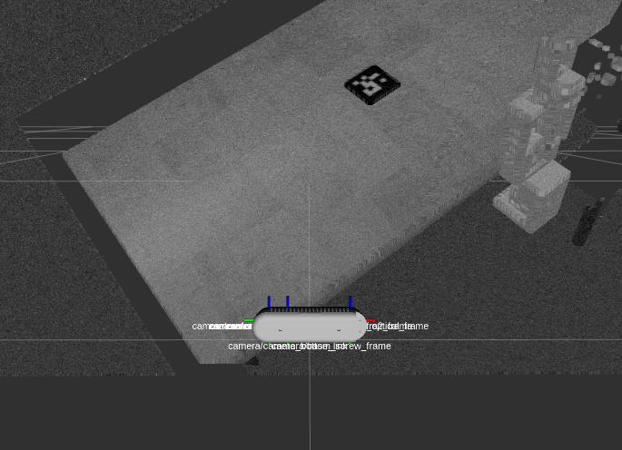

## Outline

### Pick and Place Simulation

- Lights, Handy, Action
- Camera Calibration Package
- GKNet in Action 

### Image Detection and Segmentation

- Presented by Nick after (or before) this presentation

---

## Lights, Handy, Action

### Progress

- Gazebo world with a Realsense D435, Handy, and a table.
- Gazebo is configured to work with MoveIt configured for Handy.

## Gazebo World

{ height=88% }

## Realsense D435 Point Cloud in RViz

{ height=88% }

## Handy MoveIt in RViz

{ height=88% }

## Demo Video

### YouTube

[Realsense, Handy, and Gazebo Demo Video](https://youtu.be/XW8UfeKfWWQ)

---

## Camera Calibration Package

### Progress

Mostly functional, reuses [ivapylib/camera](https://github.com/ivapylibs/camera) to determine camera extrinsics via OpenCV and a single ArUco tag. Needs more tests to ensure robustness.

### Procedure

Spawn an ArUco tag with fixed world location. Then:

1. Republish the camera info topic
1. Wait until an ArUco tag is detected
1. Perform calibration; wait until transformation matrix is stable
1. Publish the transformation matrix
1. Publish calibration status

## Calibration Extrinsic Publisher

Latched topic that publishes the transformation matrix from the camera to the world.

### Echoing the Topic

```bash
$ rostopic echo /calibration/camera/camera_extrinsics
header: 
  seq: 1
  stamp: 
    secs: 0
    nsecs: 0
  frame_id: ''
M_CL: [
  0.9999001035866886, 0.011796350567605439, 0.0077864600824209705, 0.016687101956226903,
  0.013191277641741089, -0.9766756099030278, -0.21431458936509007, 0.010765574323209938, 
  0.005076715622081074, 0.2143958934630858, -0.9767336524481266, 0.9941209615079347, 
  0.0, 0.0, 0.0, 1.0
]
```

---

## GKNet in Action

### Paper Reference

[Xu, Ruinian, Fu-Jen Chu, and Patricio A. Vela. "GKNet: grasp keypoint network for grasp candidates detection." The International Journal of Robotics Research 41, no. 4 (2022): 361-389.][gknet_paper]

[gknet_paper]: https://arxiv.org/abs/2106.08497

### Goal

Take an image from the pick and place simulation and run it through the GKNet model.

---

## Color Image

{ height=88% }

## Depth Image

{ height=88% }

## GKNet Architecture


## Heatmap - Left Means

{ height=88% }

--- 

## Heatmap - Right Means

{ height=88% }

## Heatmap - Center Means

{ height=88% }

## Ranked Predictions

{ height=88% }

## Ranked Predictions with Center Thresholding

{ height=88% }

## What next?

Instead of a one-off script, the GKNet model will be integrated into a ROS node that can be used in the pick and place simulation.

### Inputs

- `/camera/color/image_raw`
- `/camera/aligned_depth_to_color/image_raw`
- `/camera/color/camera_info`
- `/camera/aligned_depth_to_color/camera_info`
- `/calibration/camera/camera_extrinsics`

### Outputs (TBD)

- `/gknet/predictions`
  - ranked list of keypoint pairs in camera coordinates
- `/gknet/image_annotated`
  - image with keypoints and bounding boxes drawn on it

---

## Thank you!

Questions?