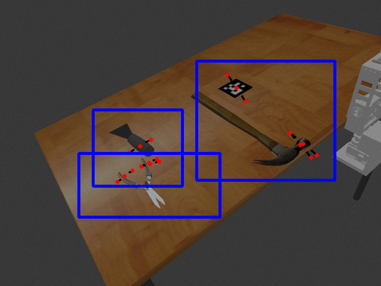

## Outline

### Pick and Place Simulation

- GKNet ROS Module
- Current/Future Work

### Handy and D435 in the Lab

Presented by Ashlynn and Calvin.

---

## GKNet ROS Module

GKNet model will be integrated into a ROS node that can be used in the pick and place simulation.
Visual demo runs from a Docker container.

### Inputs

- `/camera/color/image_raw`
- `/camera/aligned_depth_to_color/image_raw`
- `/gknet/object_filter`
  - A list of bounding boxes to perform per-object grasp ranking

### Outputs

- `/gknet/keypoints`
  - ranked list of keypoint pairs in camera coordinates
- `/gknet/annodated_image`
  - image with keypoints and bounding boxes drawn on it

## GKNet ROS Module Demo

{height=75%}

## Integration: Architecture Overview

{height=80%}

## Current/Future Work

Integration across all the components is still required, but the perception side is mostly complete.

### TODO for pick-and-place demo

- Bug with ApproximateTimeSynchronizer in GKNet module
- SimData models lack mass/physics properties needed for grasping
- TF transform nodes for grasping poses from camera to world frame
- Implementation of segmentation/YOLO bounding boxes into GKNet
- Implementation of MoveIt planning and execution on selected grasps
- Verification of YOLO/GKNet on a real D435 camera
- Verification of calibration code on a real D435 camera
